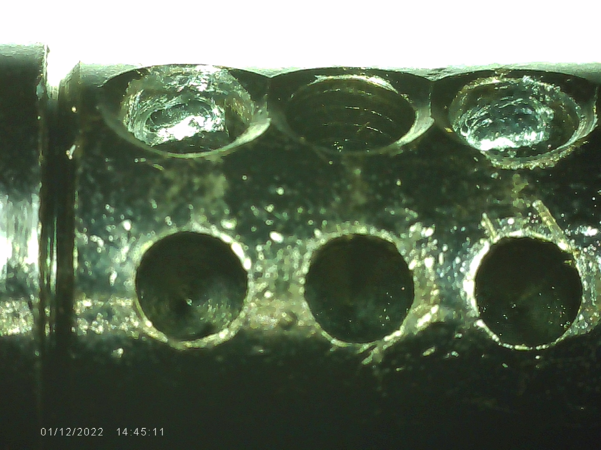

# About
This page documents my first challenge lock created to fulfill the LPU blue belt requirements. I've named this lock "Delta 1". Below you will find details about this
challenge lock.

# Original Lock
* Make: Kwikset
* Model: KIK 5 pin

# Core Modifications
The core has symmetrical undercutting to chambers 1 and 3.
* Core Left
  * 
* Core Right
  * 

# Key Pin Modifications
Only the 2nd key pin has modifications; a single serration
* Key Pin #2
  * 
