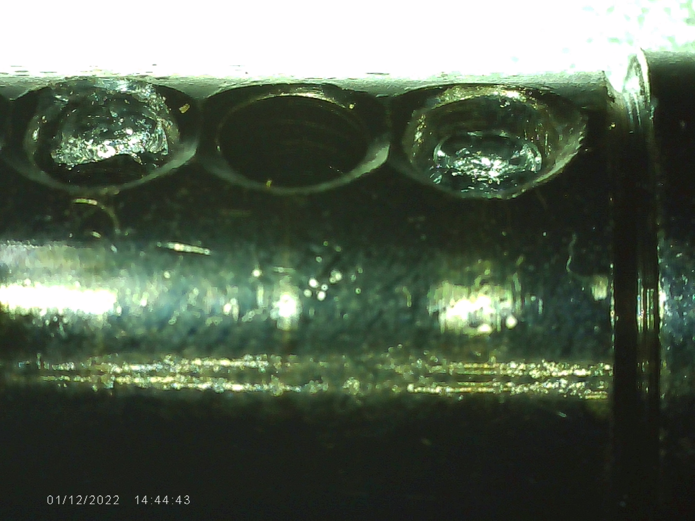
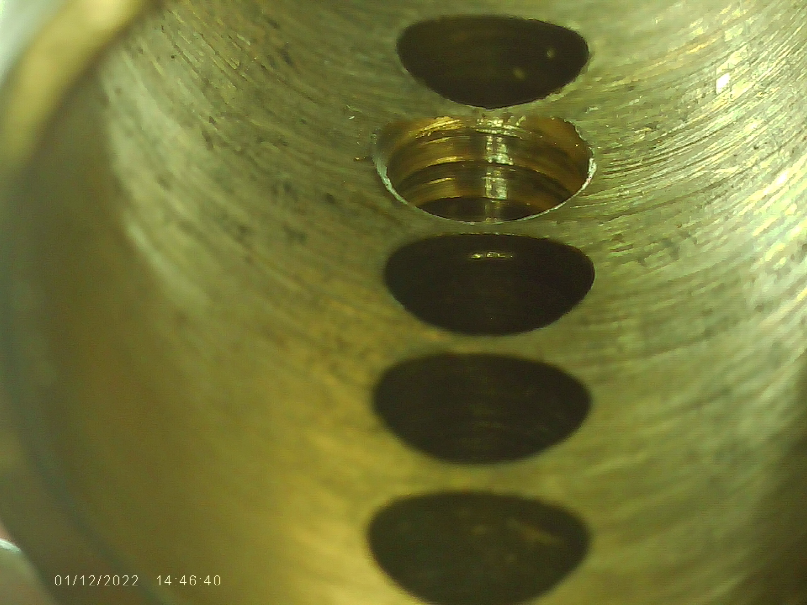
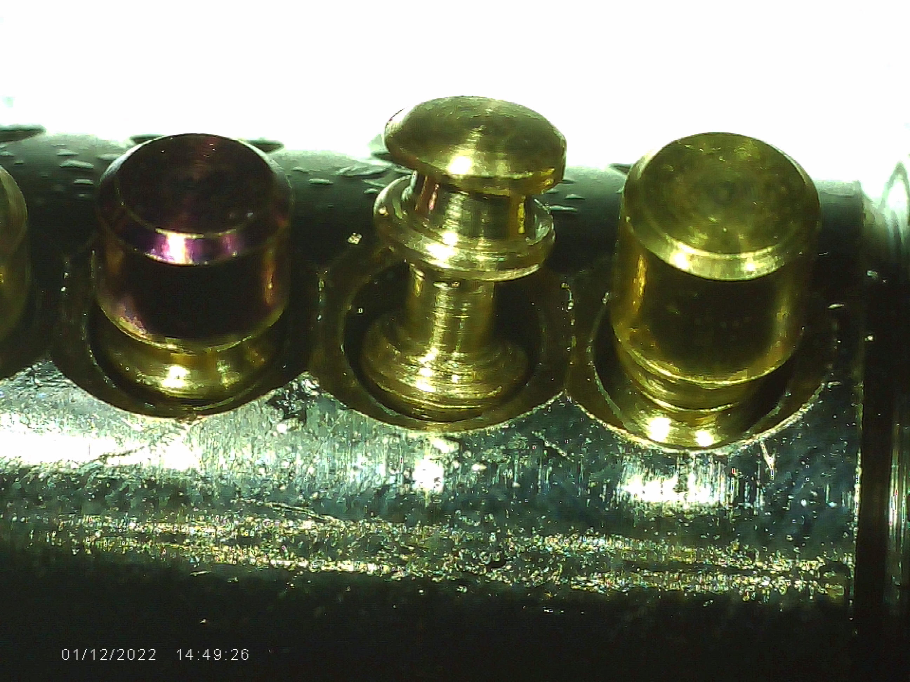
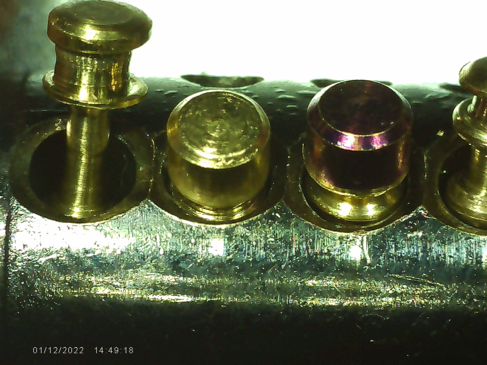

# About
This page documents my first challenge lock created to fulfill the LPU blue belt requirements. I've named this lock "Delta 1". Below you will find details about this
challenge lock.

# Note
The date/times on the photos should be ignored as the time was not set correctly on the digital micrscope used to capture the photos. This challenge lock was created between October 23rd-24th, 2023.

# Original Lock
* Make: Kwikset
* Model: KIK 5 pin

# Tools Used
* Digital Microscope (photos)
* Dremel
  * Engraving Bit
* Hacksaw Blade
* 1000 Grit Sandpaper

# Core Modifications
The core has symmetrical undercutting to chambers 1 and 3.
* Core Left
  * 
* Core Right
  * 
 
# Bible Modifications
The bible has only one modification; threading in chamber #2.
* Bible
  * 

# Key Pin Modifications
Only the 2nd key pin has modifications; a single serration.
* Key Pin #2
  * 

# Driver Pin Modifications
Every driver pin has been modified.
* Driver Pin #1 - Spool/Serration Hybrid
  * 
* Driver Pin #2 - Fat Spool/Short Spool Combo
  * 
* Driver Pin #3 - Micro Spool/Serration
  * 
* Driver Pin #4 - Small Spool/Sharp Serration
  * 
* Driver Pin #5 - Long Spool/Serration
  * 
 
# Key Pins Side-by-Side

# Driver Pins Side-by-Side

# Pins Inside Core
* Front
  * 
* Rear
  * 
