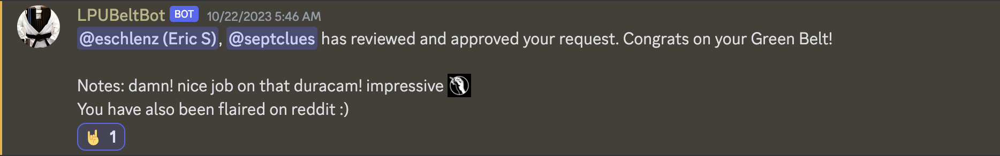
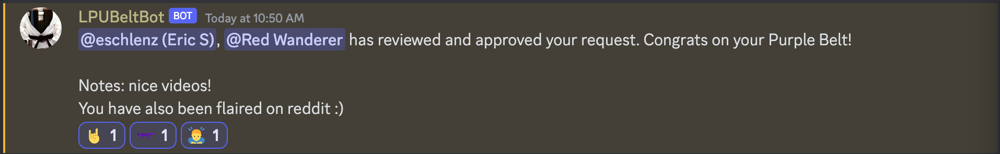

# About
This is my home for my documentation related to [LPU (Lock Pickers United)](https://www.reddit.com/r/lockpicking/). I'm using this as a central repository for resources I need to share as a member of the LPU.

# Belt Request Videos
* Green Belt
  * [Medeco Duracam](https://youtu.be/23MHaHG4b7k?si=L5R5kqTtuqIdboLt)
  * Awarded Green Belt - 10/22/2023
  * 
* Purple Belt
  * [Challenge Lock](https://discord.com/channels/140129091796992000/282173282546089985/1167901347824271481)
  * [Medeco M3](https://discord.com/channels/140129091796992000/282173282546089985/1167901347824271481)
  * [Kwikset Smartkey](https://discord.com/channels/140129091796992000/282173282546089985/1167901347824271481)
  * Awarded Purple Belt - 10/31/2023
  * 
* Brown Belt
  * [Tool Specs - EVVA ICS Flag Pick](https://github.com/eschlenz/Lock-Picking-Public/tree/main/LPU/Tools/EVVA%20ICS%20Flag%20Pick)
  * [Medeco Duracam](https://youtu.be/23MHaHG4b7k?si=L5R5kqTtuqIdboLt)
  * [EVVA ICS](https://youtu.be/d5d48lC0KP8?si=_BsZclj_lEjyjqKe)

# Challenge Locks
* My first challenge lock creation: ["Delta #1"](DELTA_1)

# Custom Tools + Specs
* [EVVA ICS Flag Pick](https://github.com/eschlenz/Lock-Picking-Public/tree/main/LPU/Tools/EVVA%20ICS%20Flag%20Pick)
