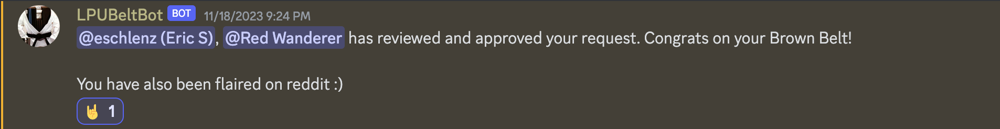

# About
This is my home for my documentation related to [LPU (Lock Pickers United)](https://www.reddit.com/r/lockpicking/). I'm using this as a central repository for resources I need to share as a member of the LPU.

# Belt Request Videos
* Green Belt
  * [Medeco Duracam](https://www.youtube.com/watch?v=23MHaHG4b7k)
  * Awarded Green Belt - 10/22/2023
  * 
* Purple Belt
  * [Challenge Lock](https://github.com/eschlenz/Lock-Picking-Public/tree/main/LPU/DELTA_1)
  * [Medeco M3](https://www.youtube.com/watch?v=1w8HsfxLv5I)
  * [Kwikset Smartkey](https://youtu.be/kC1vp0_bt5g?si=q81mX55eXcMq27L8)
  * Awarded Purple Belt - 10/31/2023
  * 
* Brown Belt
  * [Tool Specs - EVVA ICS Flag Pick](https://github.com/eschlenz/Lock-Picking-Public/tree/main/LPU/Tools/EVVA%20ICS%20Flag%20Pick)
  * [Medeco Duracam](https://www.youtube.com/watch?v=23MHaHG4b7k)
  * [EVVA ICS](https://www.youtube.com/watch?v=zhpDa8Lffy0)
  * Awarded Brown Belt - 11/18/2023
  * 

# Challenge Locks
* My first challenge lock creation: ["Delta #1"](DELTA_1)

# Custom Tools + Specs
* [EVVA ICS Flag Pick](https://github.com/eschlenz/Lock-Picking-Public/tree/main/LPU/Tools/EVVA%20ICS%20Flag%20Pick)
