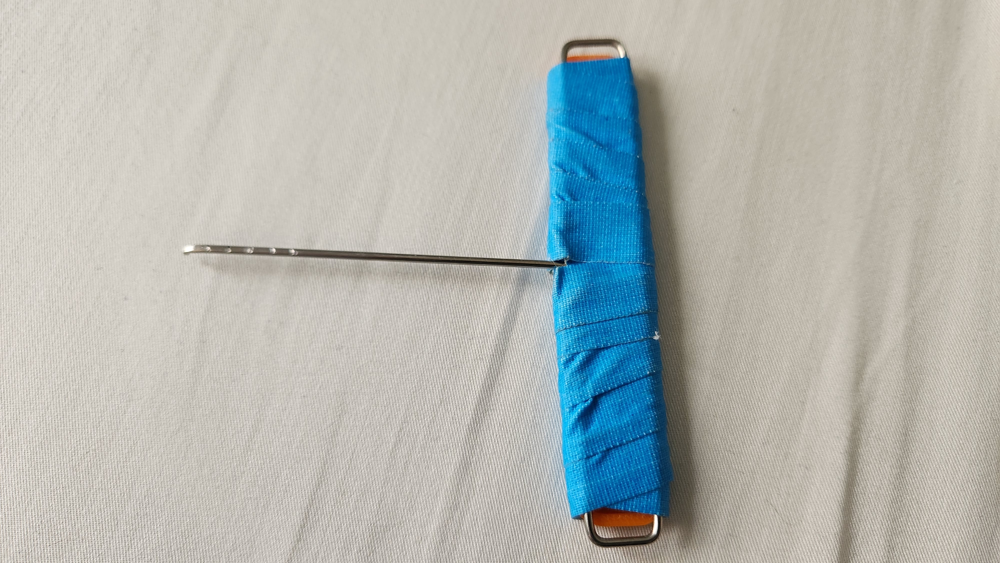
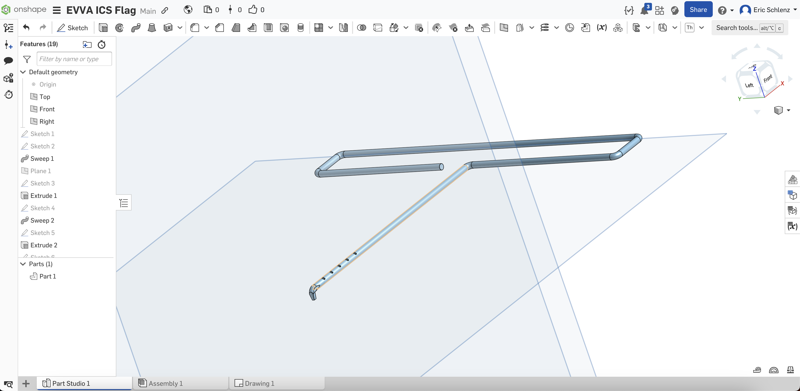

# EVVA ICS Flag Pick

During my journey to learn how to pick the EVVA ICS lock I ended up needing to create a custom flag pick. I have recreated the pick in CAD and am sharing it here. You can see
this pick in use in my picking video for the [EVVA ICS](https://youtu.be/zhpDa8Lffy0?si=67tsphZe8olNB93P).

# Specs
* [Original OnShape CAD Document](https://cad.onshape.com/documents/e372d5d0ee208b7fcd49ad5c/w/4e87f7a65f7fbfa709a58800/e/20436135ea79bedfad32d4b8?renderMode=0&uiState=65592153573c7562341b6999)
* [2D CAD Draft Drawing](evva_ics_flag_pick_drawing.pdf)
* [CAD STEP File](evva_ics_flag_pick.step)

# Materials
This pick was made out of 1.6 mm piano wire. You can buy a batch of different diameter piano wires from [Amazon](https://www.amazon.com/dp/B0B491L6LV?psc=1&ref=ppx_yo2ov_dt_b_product_details)https://www.amazon.com/dp/B0B491L6LV?psc=1&ref=ppx_yo2ov_dt_b_product_details.

# Tools
1. Vice or pliers to hold wire while you bend.
2. Wire cutters for trimming to length.
3. Dremel
  1. Stone bit for grinding away material near the tip.
  2. Cut off wheel for serrations (depth markers).
4. Blue Dykem or Sharpie to fill in depth marker serrations.
5. 320 and 1,000 grit sand paper to smooth rough edges.

# How-To
COMING SOON
